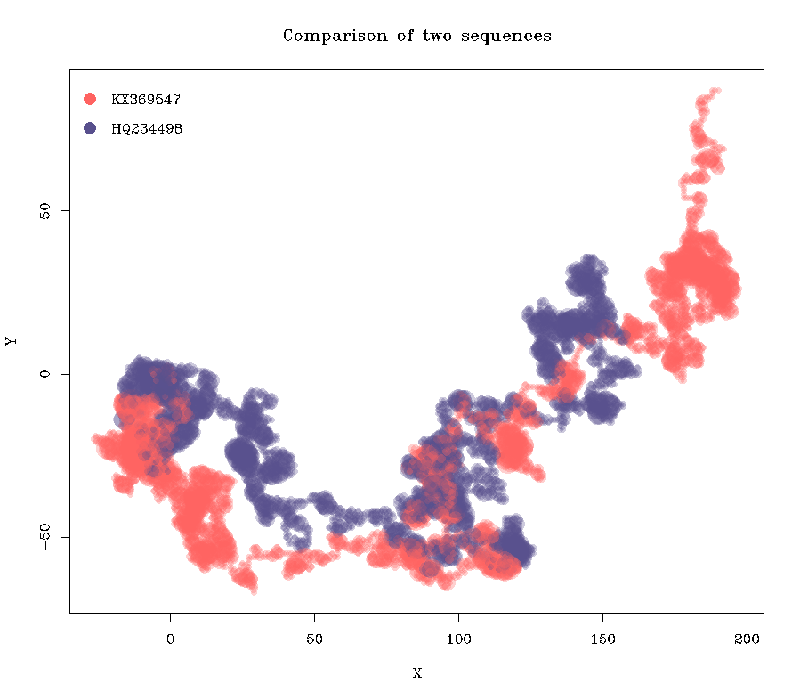
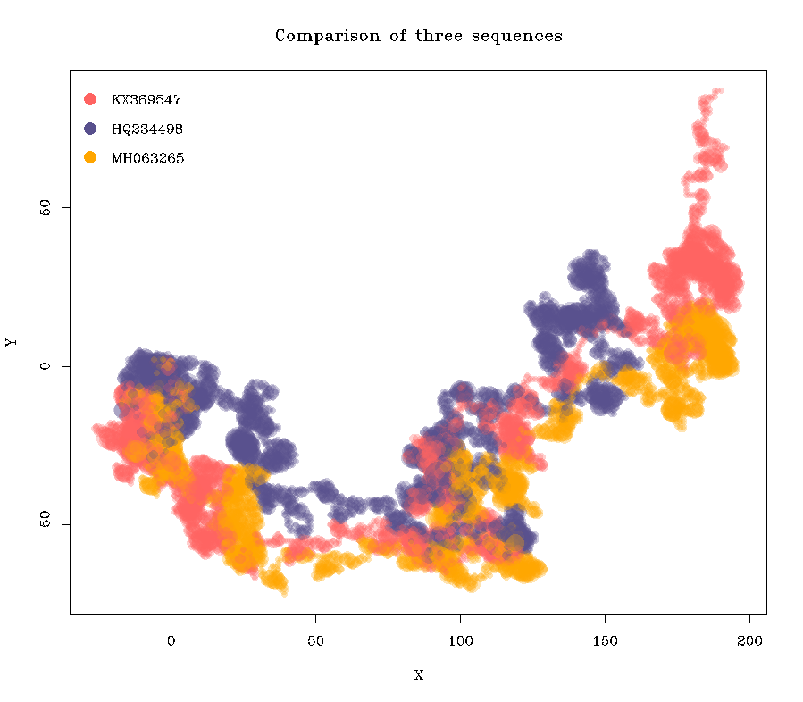

## GNR-DNA
Graphical and Numerical Representation of DNA Sequences

R library for characterizing biological sequences graphically and numerically. If you would like to get the gist of implemented approach please read the following article 
> Bo Liao, Kequan Ding, *A 3D graphical representation of DNA sequences and its application*. Volume 358, Issue 1, 2006, Pages 56-64.

## Install
In order to install and load the package run the following code in the R console

```r
library(devtools)
install_github('officialprofile/GNR-DNA')
library(drep)
```

## How to use it
In most cases a single line of code can yield satisfactory results. For example

```r
plot2DGraph(c('KX369547', 'HQ234498', 'MH063265'), genbank = TRUE, main = 'Comparison of three sequences')
```
returns a ready-to-use graph of the ZIKV genomes



```r
plot2DGraph(c('DQ415340','AF509109'), genbank = TRUE, 
            legend.pos = 'bottomright', 
            colorset = c('lightblue', 'orange'),
            main = 'Two influenza A type NA genes (H1N1 and H5N1)')
```



Notice that plotting such graphs can be achieved solely by putting the GenBank accession numbers. plot2DGraph is intended to be quite versatile though, i.e. many parameters can be adjusted.

In similar fashion one can obtain numerical characteristics by employing dRep function, e.g.
```r
dRep(c('KX369547', 'HQ234498'), genbank = TRUE)
```
returns the following dataframe
|         |len  |mi_x  |mi_y   |sqrt   |...
|---------|-----|------|-------|-------|---
|KX369547 |10769|84.660|-16.061| 86.170|...
|HQ234498 |10269|75.171|-17.691| 77.224|...

Naturally, instead of using data from GenBank, one can apply implemented method to one's own sequence or vector of sequences, e.g.
```r
seq <- 'ACCCTCGCGCCGCGATTCTACGGACCCTGAAAATG'
dRep(seq)
```
