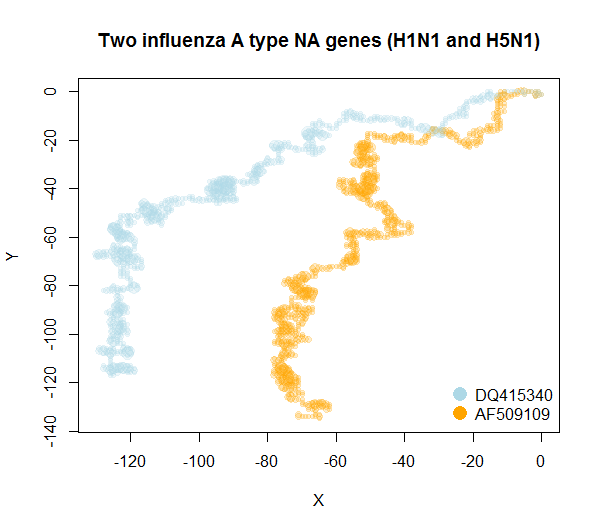

# drep
Graphical and Numerical Representation of DNA/RNA Sequences

R library for characterizing biological sequences graphically and numerically. For technical details please read one of the articles mentioned below.

1. 2D-dynamic representation of DNA/RNA sequences as a characterization tool of the zika virus genome, MATCH Communications in Mathematical and in Computer Chemistry 77(2):321-332
2. Dynamic Representations of Biological Sequences, MATCH Communications in Mathematical and in Computer Chemistry 82(1):205-218

## Install
In order to install and load the package run the following code in the R console

```r
library(devtools)
install_github('officialprofile/drep')
library(drep)
```

## How to use it
In most cases a single line of code can yield satisfactory results. For example

```r
plot2DGraph(c('KX369547', 'HQ234498'), genbank = TRUE, main = 'Comparison of two sequences')
```
returns a ready-to-use graph of the ZIKV genomes


```r
plot2DGraph(c('KX369547', 'HQ234498', 'MH063265'), genbank = TRUE, main = 'Comparison of three sequences')
```



Notice that plotting such graphs can be achieved solely by putting the GenBank accession number.

In similar fashion one can obtain numerical characteristics by employing dRep function, e.g.
```r
dRep(c('KX369547', 'HQ234498'), genbank = TRUE)
```
returns the following dataframe
|         |len  |mi_x  |mi_y   |sqrt   | I_xx    | I_yy    |  I_xy    |...
|---------|-----|------|-------|-------|---------|---------|----------|---
|KX369547 |10769|84.660|-16.061| 86.170| 11371982| 60032538|-17116036 |...
|HQ234498 |10269|75.171|-17.691| 77.224|  5137647| 31072416|  -1928373|...

Naturally, instead of using data from GenBank, one can apply implemented method to one's own sequence or vector of sequences, e.g.
```r
seq <- 'ACCCTCGCGCCGCGATTCTACGGACCCTGAAAATG'
dRep(seq)
```
